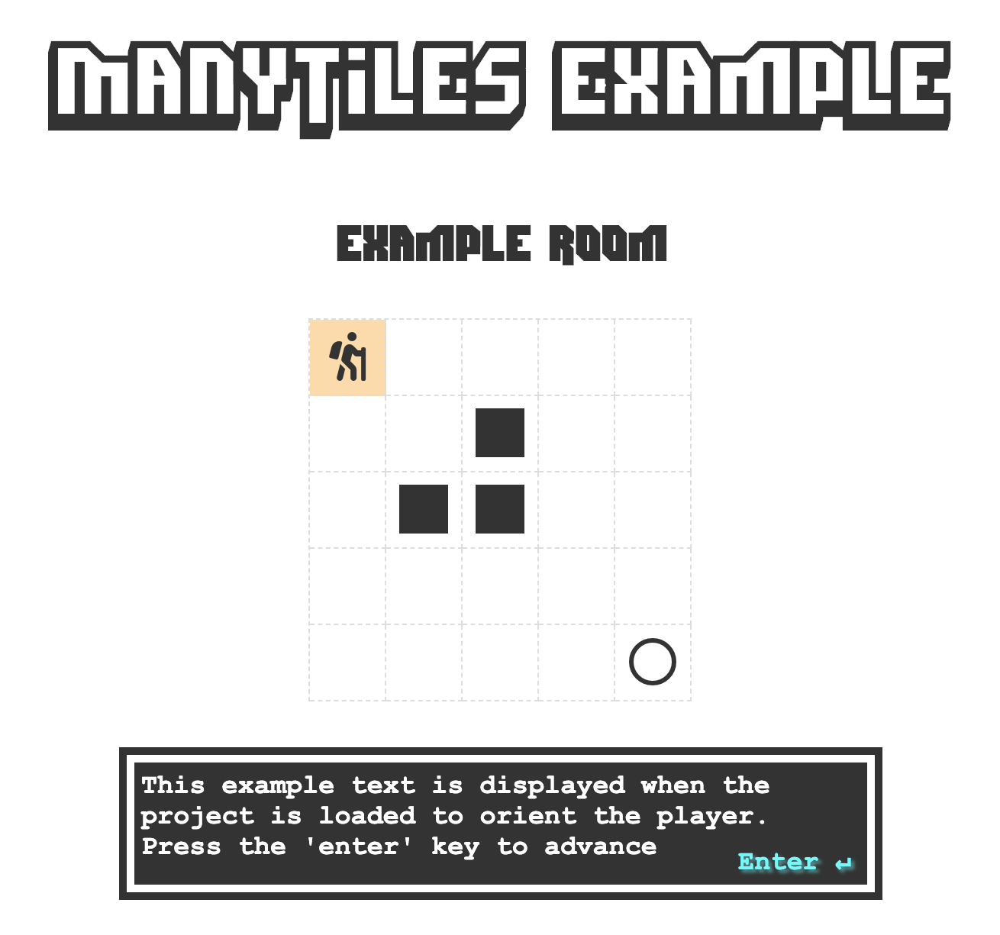

# ManyTiles

The **ManyTiles framework** makes it easy to create an interactive web-based 2D tile project. **ManyTiles**, at its core, is a 2D grid of tiles onto which an `agent` is rendered. The `agent` can move in four directions around the grid to explore tiles. Tiles can be configured prevent movement or trigger *events* which hook into arbitrary user code to modify the state of the project.

# Use Cases

**ManyTiles** is written in a very general manner and can be used to create a large variety of projects. The following is a list of example projects:

- Dungeon Crawling Game
- Interactive Artwork
- Brick-breaker Clone
- An Interactive Story Experience
- Prototypes, and much more

# Example Usage

# Screenshots

# Example Project

# Dev Notes

- [ ] Highlight speaker/source
- [ ] Chunk text by words
- [ ] Inventory system
    - [ ] Events can check inventory for items
    - [ ] Inventory items are shown in inventory below textbox area

- [x] Note, on enter press, world should check in with dialogue system and render the next line of dialogue if something is in progress
- [x] Objects should freeze during dialogue
- [x] Text box system
- [x] Load queue with text objects
- [x] When called, show text box one after the other

# Lorem Ipsum
Lorem ipsum dolor sit amet, consectetur adipiscing elit, sed do eiusmod tempor incididunt ut labore et dolore magna aliqua. Ut enim ad minim veniam, quis nostrud exercitation ullamco laboris nisi ut aliquip ex ea commodo consequat. Duis aute irure dolor in reprehenderit in voluptate velit esse cillum dolore eu fugiat nulla pariatur.
